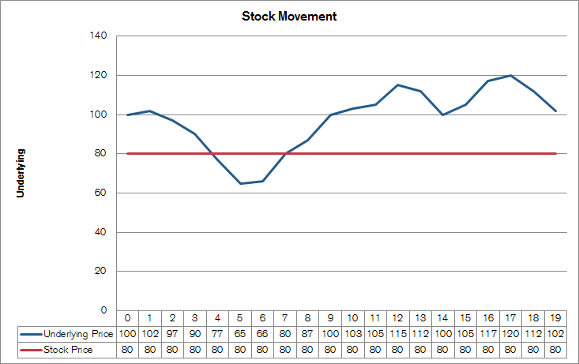

# Exercise

I'm a junior trader and I want one of our desk developers to build a tool to display the payoffs of a vanilla option
over time. To do so, he will use a library that you will be developing.

Assuming that interest rate, volatility, and time to maturity remain constant throughout, the only parameters to be
considered for the calculation of the payoff are spot price and strike price.

## Definitions

The plain vanilla option is the most traded option. There are two types of vanilla options, `Call` and `Put` Options.

`Call` Options give the owner the right to buy the underlying for a fixed price `K` (the strike) at expiration.

The payoff of this option is thus `S - K` when the stock's spot price `S` is above the strike `K`, and `0` otherwise.

`Put` Options give the owner the right to sell the underlying for a fixed price.

This option has a payoff of `K - S` when the stock's spot price is below the strike `K`, and `0` otherwise.

## Relevant Equations

The payoff equations for this option are given by:

    Call(t) = max(S(t) - K, 0)
     Put(t) = max(K - S(t), 0)

## Test Data

       t: [ 0, 1, 2, 3, 4, 5, 6, 7, 8 , 9, 10, 11, 12, 13, 14, 15, 16, 17, 18, 19 ]
    S(t): [ 100, 102, 97, 90, 77, 65, 66, 80, 87, 100, 103, 105, 115, 112, 100, 105, 117, 120, 112, 102 ]
       K: 80

## Resources

[http://www.investopedia.com/terms/o/option.asp](http://www.investopedia.com/terms/o/option.asp)

