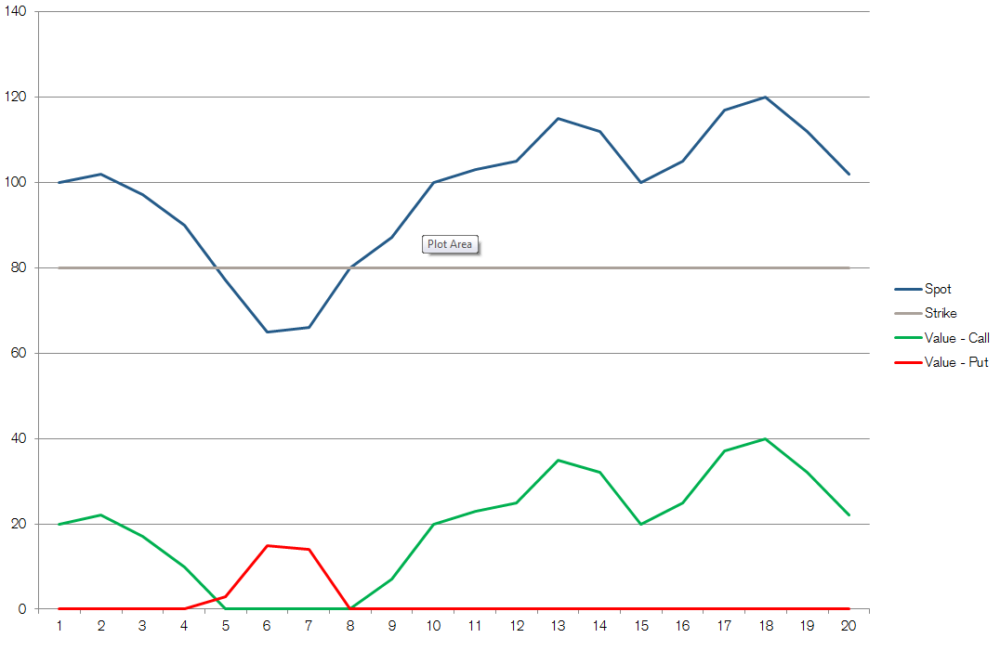

# Background

A junior trader is building a tool to display the payoff of an option.
To do so, he needs a Java library that will calculate the payoff of an option at a given point in time.

The only parameters to be considered for the payoff are spot price and strike price.
* The strike price is defined when the option is created
* The spot price varies over the life of the option, according to the performance of a stock

# Definitions

There are two types of options, call options and put options.

Call options give the owner the right to buy the underlying for a fixed price (the strike) at expiration.
The payoff of this option at time t, is spot(t) - strike when the spot price is above the strike, and 0 otherwise, i.e:

    CallOptionPayoff(t) = max(Spot(t) - Strike, 0)

Put options give the owner the right to sell the underlying for a fixed price.
The payoff of this option at time t is strike – spot(t) when the spot price is below the strike, and 0 otherwise, i.e:

    PutOptionPayoff(t) = max(Strike - Spot(t), 0)

## Example Data

       t: [ 0, 1, 2, 3, 4, 5, 6, 7, 8 , 9, 10, 11, 12, 13, 14, 15, 16, 17, 18, 19 ]
    S(t): [ 100, 102, 97, 90, 77, 65, 66, 80, 87, 100, 103, 105, 115, 112, 100, 105, 117, 120, 112, 102 ]
       K: 80

## Resources

[http://www.investopedia.com/terms/o/option.asp](http://www.investopedia.com/terms/o/option.asp)